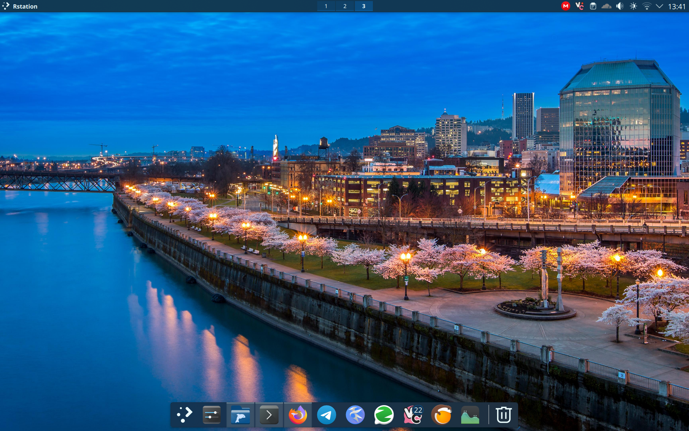

# exquisite-naz

A KDE Plasma Rice

This is a macOS-like KDE Plasma rice, featuring a dock at the bottom, a global menu on top, and a tray positioned to the left of the top panel. The desktop switcher is located in the middle. Hovering on the left side of the screen activates a side panel containing widgets such as network speed, a resource monitor, and a timer.

All configuration details are stored within the dot files in this repository.

**Missing Files:**
Due to their large size, fonts and icons are not included in this repository.
- **Font Used:** Jetbrains Nerd Font
- **Icon Pack:** Breeze Chameleon Dark (Available at: [Breeze Chameleon Dark](https://store.kde.org/p/1281798))

**Konsave Integration:**
This rice can be easily imported using the [konsave program](https://github.com/Prayag2/konsave). A `.knsv` file is provided for this purpose.
